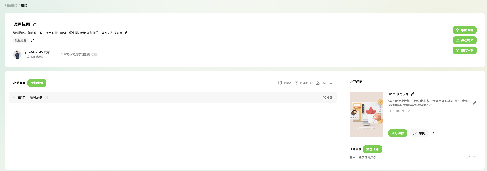
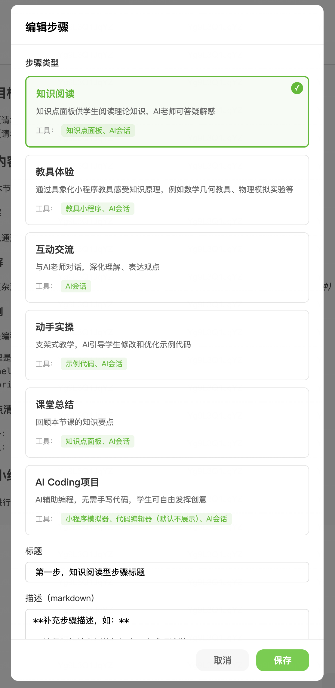
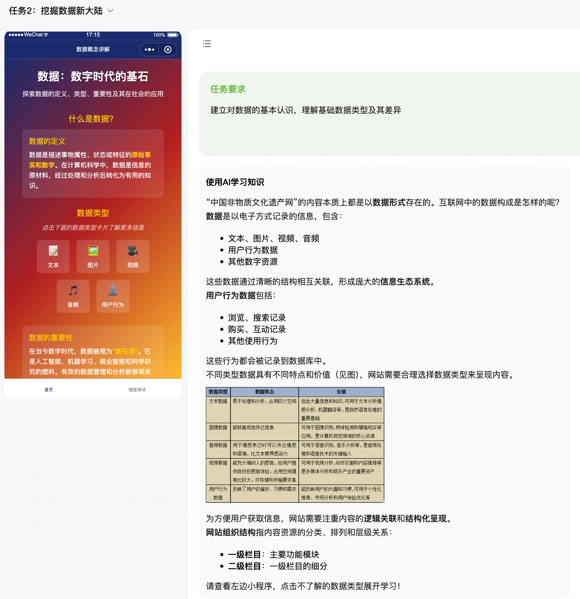
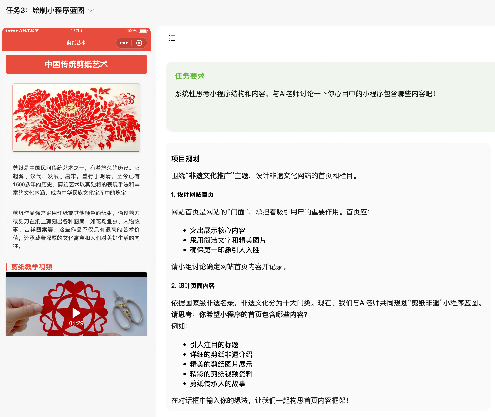
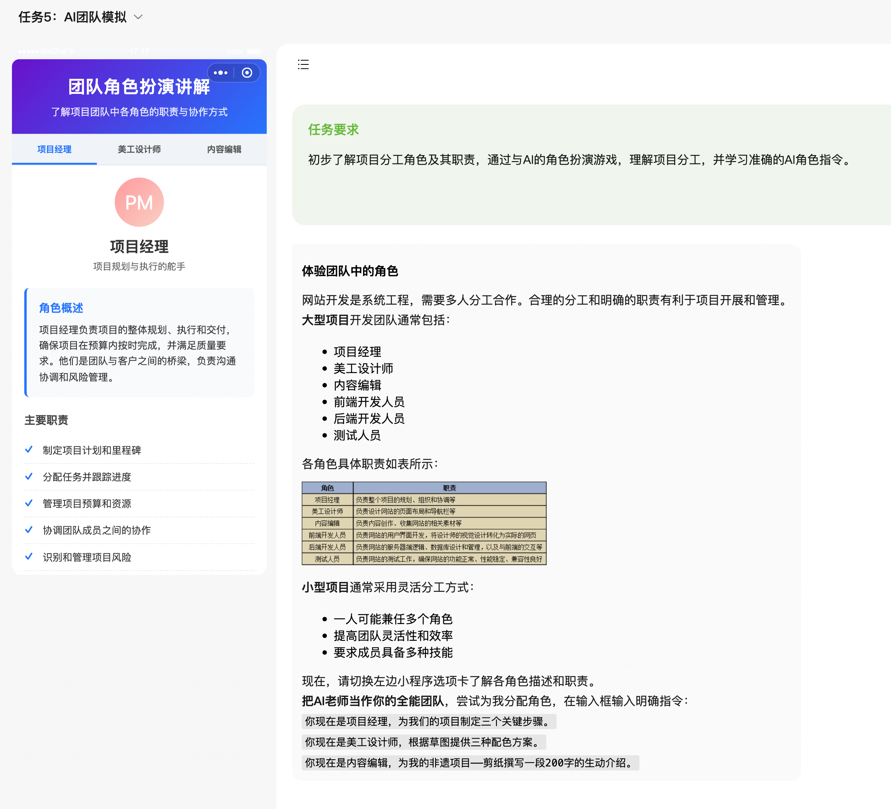

# 2026 教育 AI 年中目标
# 一句话核心目标
以 Agentic 的方式，结合 Agent + 模型训练 做好基础能力保障，提升教育用户规模及跑通业务反馈 -> Agent -> 模型训练完整闭环

# 业务反馈 -> Agent -> 模型训练完整闭环，可用性质量保障
## 现状
教育数据上报质量参差不齐，核心链路甚至埋点缺失，也没有有效监控手段。上报数据 + 线上用户反馈无法直接有效的觉察 AI 相关能力的不足及指导 Agent 和模型的迭代。在人工进行数据清洗时，数据源散落多个平台，字段设计奇怪，困难重重

## 数据上报 -> 分析 -> 清洗

### 目标
搭建完整 AI 请求链路上报及数据分析清洗，完成以下目标：
1. **全链路无遗漏梳理上报**，覆盖 浏览器 -> Agent -> LLM
2. **契合 AI 的字段及内容结构设计**，可以有效且快速的进行数据筛选、数据清洗，投入 Agent 及模型迭代中
3. **教、学、练 环节人工标注**，充分利用教师及学生的主观能动性，设计 有感知 + 无感知 的数据标注能力
4. **AI 相关问题及时发现**，完善 AI 相关的监控系统，对 AI 建立不同于传统工程上的可用率指标

## Agent 迭代

### 目标
**建立数据驱动的质量评估体系** 建立一套涵盖代码正确性、样式还原度及回答质量的量化指标
**构建全链路的自动化归因机制** 对决策链路的透明化追踪，以便快速定位 Bad Case 的根本原因
**优化资源消耗方面的管理** 优化长上下文下的对话情况、token 消耗以及对话时间，节省服务器资源消耗

### 目标拆解
1. **全链路数据采集与监控**                                                                                                                                  
   - 完善 Agent 内多维度全链路的数据埋点上报，对线上 Agent 做真实数据追踪                                                                                 
   - 构建好多维的指标，从客观角度和主观角度出发，客观指标如：代码通过率、功能是否完成、完成任务所用的 toolcall 次数、token                                
   消耗、调用时延等，主观角度如：样式美化程度、模型返回内容语气等                                                                                           
   - 建立资源消耗与性能监控看板，实时监控 Token 消耗量与响应延迟，快速识别高耗能的异常会话并进行针对性优化
2. **数据驱动的评估与归因**
   - 整理出真实用户的高质量评测集和训练集，验证模型生成内容，辅助模型训练生成更优质的回答
   - 通过真实用户的高质量评测集，做 Agent 迭代的 A/B 测评，更好的评估 Agent 某一更改点带来的优化
   - 前期以人工打标为主，后期转为自动化归因+人工打标为辅，构建全链路的自动化归因机制
3. **Bad Case 到模型优化的闭环迭代**
   - 将定位到的 Bad Case 自动转化为 SFT 数据，形成"发现错误 -> 归因 -> 优化模型"的自动化闭环
4. **推理资源优化**
   - 做好长对话的上下文管理
   - 动态模型路由机制，在文本类的执行场景中（如需求澄清），可以切换至小参数模型，在保障效果的前提下大幅降低推理成本
   - 项目内 AGENTS.md 规范：在微信教育生态内所有小程序根目录增加 AGENTS.md，作为上下文压缩入口与规则基线，降低长对话依赖与 token 消耗及支持小程序在生态内流转。

## 模型训练相关

### 目标
基于业务反馈及线上 bad case，打通从数据清洗到模型训练上线的完整路径，完成以下目标：
1. **打通端到端训练路径**，覆盖 数据清洗 -> 训练数据构造 -> 模型微调 -> 评测 -> 灰度上线 全流程，形成可复用、可持续迭代的训练 pipeline
2. **优化奖励函数设计与过程奖励建模**，对线上真实轨迹进行 reward 打分，构建契合教育场景的多维评分体系，强化过程奖励而非仅结果奖励
3. **Bad Case 驱动的闭环迭代机制**，打通业务反馈（客观数据 + 主观标注）到训练数据的转化链路，实现 bad case 归因、生成训练样本，缩短问题发现到模型修复的周期
4. **T+n 训推结合**，探索在线学习与近实时模型更新能力，使模型能够快速响应新发现的 bad case 和业务需求变化，缩短训练到推理部署的时间差

# 模型能力支持

## 项目式教学
做好常态化的项目式教学支持，涵盖编程教学及基础学科教学，用 AI 解决课前、课中、课后的全流程打通

## 现状
老师有教学教案，但是没有能力转化为项目式教学，需要外部服务商支持。目前共有接近 5 家服务商，平均每个服务商每个月只能产出 2～3 门课程。同时没有有效的评估手段来评判课程的好坏，只能依赖上课来得到主观评价。服务商课程质量参差不齐，课程的创作知识无法复用共享。

## 目标拆解
### 课前
可以通过 AI 能力稳定的针对教师 教案/教学资料 生成具体的课程

| 能力       | 描述                                                                                   |
|----------|--------------------------------------------------------------------------------------|
| 教案解析与存储  | 解析教师上传的教案、教学大纲等资料，提取核心知识点、教学目标和学科要求等，作为课程长期记忆，信息不达目标时与教师进行多轮对话完成内容生成                 |
| 课程基础信息生成 | 基于存储的长期记忆及与教师完成多轮对话，辅助教师生成必要的课程基础信息及拆分课程为 小节 -> 任务，整体以教师为主导，AI 以教案解析后的知识结合对平台的理解作为辅助 |
| 任务步骤生成   | 基于存储的长期记忆及课程基本信息，自动完成相关教具及课程教导步骤生成                                                   |

### 课中
AI 作为实时教学助手，在学生按步骤完成项目的过程中提供即时支持，同时帮助教师掌控课堂节奏

| 能力       | 描述                                                                                   |
|----------|--------------------------------------------------------------------------------------|
| 实时答疑与引导 | 学生在完成任务步骤时遇到问题，AI 基于当前课程上下文进行针对性引导，优先给提示而非直接给答案，保留学生思考空间 |
| 代码实时诊断 | 学生代码运行异常时，AI 自动定位错误原因并给出修复建议，区分语法错误、逻辑错误和平台 API 使用错误 |
| 动态难度调节 | 根据学生当前步骤的完成情况（耗时、错误次数、求助频率），动态调整后续步骤的提示详细程度和任务复杂度 |
| 教师课堂看板 | 实时汇总全班学生的任务进度、卡点分布和求助情况，辅助教师快速识别需要重点关注的学生或普遍卡点 |
| 课堂节奏辅助 | 基于全班整体进度，向教师建议何时进行集中讲解、何时放手让学生自主探索，辅助控制课堂节奏 |

### 课后
总结沉淀 + 自主延伸，分教师侧和学生侧两个视角

| 能力       | 描述                                                                                   |
|----------|--------------------------------------------------------------------------------------|
| 课程总结生成 | 基于课中的实际教学数据（完成率、卡点分布、高频问题），自动生成本次课程总结报告，辅助教师复盘 |
| 学生学情报告 | 为每位学生生成个性化学情分析，包含知识点掌握情况、薄弱环节、与班级平均水平的对比 |
| 针对性练习推荐 | 根据学生课中暴露的薄弱点，自动生成或推荐针对性的巩固练习题，强化未掌握的知识点 |
| 学科小工具生成 | 基于课程涉及的知识点，生成可独立运行的学科小工具（如数学公式可视化、物理模拟实验），供学生课后自主探索 |
| 课程迭代建议 | 基于多次授课的累积数据，向教师输出课程优化建议（如某步骤普遍卡顿建议拆分、某知识点需要增加铺垫） |

## 自由创作对齐赛事获奖级别案例

## 目标
以小程序赛事为训练基准，以获奖项目为目标，可通过稳定的多轮对话，基于初始输入及合理输入补充，生成完整的往年获奖参赛作品

## 往年赛事小程序能力拆解
| 能力       | 占比 |
|----------|----|
|  |    |
|  |    |
|   |    |

### 历届特等奖、一等奖小程序
【企微文档】小程序全球创新挑战赛作品集（2023-2025）
https://doc.weixin.qq.com/sheet/e3_AOMArgZ1ACcCNYvHSZhVaQk6Z8L5D?scode=AJEAIQdfAAoQzivOgZAQAASwanAHg&tab=BB08J2
【腾讯文档】青少年区域赛作品整理（全）
https://docs.qq.com/sheet/DQk9qS3ZSV1p3cVhR?tab=ug4blb
