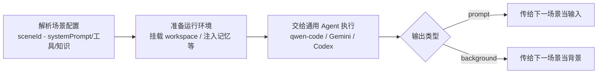

# Agent 究竟是什么？——从硬编码 LLM、workflow 再到 Agent 的演进故事

> 目标：① 让研发同学建立统一的 LLM/Workflow/Agent 认知；② 通过“硬编码 LLM → Workflow → 工具型 Agent → 自主型 Agent”这一主线，回答“Agent 是什么、我们现在处于哪一步、下一步要走向哪里”。
## 1. 开场与期待对齐
- **轻松叠甲**：LLM 的原理、训练细节，有同学已经拆得很透。今天不再聊“Transformer、模型参数”，而是把镜头直接拉到应用层——到底如何让 AI 在真实业务里从“能说”变成“能做”。
- **分享目的**：
1. 补齐“LLM、Workflow、Agent”三个词的语义差异，建立统一认知。
2. 用“硬编码 LLM → Workflow → 工具型 Agent → 自主 Agent”的演进故事，解释为什么 Agent 不是“if-else”，而是下一阶段的桥梁。
3. 探讨如何在 AI 应用层快速演进（去年火 Workflow、今年轮到 Agent、明年可能又换新名词）时，仍能把真正有价值的能力沉淀下来。
- **贯穿问题**：一句话目标——“是否能让智能助手在微信开发者工具里，从创建项目到提交审核都无需人工干预？”接下来所有阶段都会围绕这个目标展开，看看各阶段解决了什么、卡在哪。

## 2. 阶段 1：硬编码 LLM
- **接续目标**：我们希望“智能助手”替我们在微信开发者工具里，从创建项目到提交审核一条龙搞定。第一步自然是把需求写成 Prompt，直接丢给 LLM。
- **最简单的做法**：写个 ChatCompletion 包装，让模型假装自己是资深小程序工程师，输出操作指引。
  ```python
  answer = llm.ask("""
  你是资深微信小程序工程师。
  帮我完成：创建一个带商品列表的项目 -> 写基本页面 -> 本地预览 -> 上传审核。
  """)
  print(answer)
  ```
- **真实体验**：
  1. 它会给出详尽的步骤提示，比如“点击＋创建小程序项目”“在 pages/index/index.wxml 写列表”，但你仍要自己在本地拷贝/粘贴、执行命令，模型完全碰不到微信开发者工具、CLI 或代码文件。
  2. 要让它理解当前项目结构，只能把 `app.json`、`project.config.json` 等文件内容一段段贴进去。项目稍一复杂，Prompt 就成了拷贝/清理大工程，几乎不可维护。
  3. 同样的需求换个问法，得到的步骤和命令可能不一致，甚至会编造不存在的菜单项或 API——很依赖人工核对。
- **阶段 1 的结论**：硬编码 LLM 只解决了“能给建议”，没碰到“能动手”。它在各种 Chat 场景里还算顺手，但一旦要落地到具体应用（比如真实的开发流程）就无能为力——数据、权限、工具统统被隔在模型之外。这也促使我们思考：能否把 LLM 做成可编排的 API，再用 Workflow/脚本来接管重复步骤？

## 3. 阶段 2：Workflow & 模型服务
- **整体思路**：既然 LLM 无法直接“动手”，我们就把它封装成 API，配合 Workflow/脚本。流程里的每一步（创建项目、写文件、调用 CLI、上传审核）都由我们写好的脚本执行，LLM 负责“理解/生成”环节。
- **小程序流程示意**：
  ```mermaid
  flowchart TD
    A[Webhook/表单触发] --> B[LLM 节点<br/>解析需求并确定模板]
    B --> C[脚本节点<br/>initProject templateName='js']
    C --> D[脚本节点<br/>写入 pages/index/index.wxml,js,wxss]
    D --> E[CLI 节点<br/>调用开发者工具预览/上传]
    E --> F[LLM 节点<br/>总结执行结果并发送通知]
  ```
- **解决的问题**：
  - LLM 终于成为可控的 API，我们可以设定配额、参数、权限；脚本节点则负责真实执行，避免人工 复制/粘贴。
  - 常规路径（初始化代码、打包、上传）被封装为可复用模块，触发方式可以是 webhook、CI/CD、审批流，工程化程度大幅提升。
  - 同一套 Workflow 可以服务多个场景，只需在某些节点调整参数或引用不同模板。
- **新的瓶颈**：
  - 这依旧是“流程自动化”：每个步骤、分支、异常处理都得提前写在 Workflow 里。用户多问一句“能否换成测试环境运行？”都可能需要新增节点。
  - 随着需求扩张，Workflow 很快长成复杂的网状结构，节点之间互有依赖。为了覆盖更多情况，我们不断插入条件节点、并行分支、人工审批，最后连作者都看不清这张流程图。
  - 大模型相关的改动往往牵一发而动全身：例如前置节点改了 API 入参或上下文格式，后面某个节点的 system prompt/模板就得同步调整，否则整个链路会雪崩。
  - Workflow 只能应对“已知流程”，面对意料之外的需求或异常只能报错/转人工，无法根据目标重新规划路径。
    
- **遇到问题时的处理方式**：
  - 一旦流程跑错，通常需要回到流程设计层手动加节点、改条件、补审批，再重新上线 Workflow。
  - 如果脚本报错，就由人工查看日志、执行补救命令，再把 fix 写回脚本或流程。
  - 也就是说，Workflow 遇到异常后的“解决方案”仍然是硬编码，无法在执行中自主寻找备用路径。
- **承上启下的结论**：Workflow 让我们终于能执行动作，但仍然需要我们当“导演”写好所有剧本；它解决的是“流程自动化”，而非“目标自动化”。这时就需要一个能够在执行过程中自主决策、动态调度工具的角色——Agent。

## 4. 阶段 3：工具型 Agent
- **定义**：LLM（负责推理） + 工具（提供真实操作能力） + 控制/记忆模块，实现“目标驱动 + 循环执行”。核心不是写死流程，而是让 Agent 根据目标动态决定下一步。
- **机制拆解**（LLM-Reasoning-Tool loop）：
  - **LLM-Reasoning-Tool Loop**：
    ```mermaid
    flowchart LR
      U[User Goal / System Prompt] --> T[LLM Thought]
      T --> D{需要工具?}
      D -- Yes --> A[调用工具/API]
      A --> O[观察]
      O --> T
      D -- No --> R[生成最终结果]
    ```
    也就是“思考 → 选工具 → 执行 → 观察 → 再思考”的循环，直到目标达成或请求人工接管。
  - **典型分层结构**（很多论文/框架都遵循）：

  | 层级 | 名称 | 作用 | 示例                                |
    | --- | --- | --- |-----------------------------------|
  | 🧠 1 | **Cognition Layer（认知层）** | LLM 负责思考、生成、规划 | GPT-5、Claude 4.5、Gemini 2.5       |
  | 🧩 2 | **Memory Layer（记忆层）** | 存储短期/长期信息 | Context Window、DB、日志              |
  | 🛠️ 3 | **Tool Layer（工具层）** | 提供可调用的外部能力 | Function Call、MCP、文件系统、浏览器        |
  | 🧭 4 | **Reasoning / Control Layer（推理控制层）** | 决定何时调用哪个工具、何时结束任务 | LangChain Agent Loop、ReAct、LangGraph |
  | 🧑‍💼 5 | **Interface / Persona Layer（接口与角色层）** | system prompt、用户接口、角色定义 | ChatUI、CLI、Operator、Computer-use  |

- **小程序 Agent 示例**：
  - 工具清单（示例）：`InitProjectTool`、`WriteFileTool`、`CompileProjectTool`、`DevToolsCLITool`（预览/上传）、`ReportTool` 等，每个工具描述清晰、权限受限。
  - 执行日志（简化版）：
    ```
    [12:03:18] Thought: 目标是创建商城小程序，先初始化项目
    [12:03:18] Action: InitProjectTool(template=mall)
    [12:03:20] Observation: OK | 项目已创建 /workspace/mall-demo

    [12:03:21] Thought: 需要生成首页页面，写入基础模板
    [12:03:21] Action: WriteFileTool(path="pages/index/index.wxml", content=...)
    [12:03:21] Observation: OK | 写入成功

    [12:03:22] Thought: 调用编译命令，确认无报错
    [12:03:22] Action: CompileProjectTool
    [12:03:23] Observation: ERROR | DevTools CLI: 端口 9420 被占用
    [12:03:23] Thought: 端口冲突，尝试切换到 9430 后重试
    [12:03:23] Action: CompileProjectTool(port=9430)
    [12:03:24] Observation: OK | 编译成功

    [12:03:25] Thought: 预览输出二维码给开发者
    [12:03:25] Action: DevToolsCLITool(command="preview", port=9430)
    [12:03:27] Observation: OK | 预览成功，二维码地址 https://...
    ```
  - 如果某一步失败（例如 CLI 报错端口占用），Agent 会再次进入 Thought 阶段，尝试“换个端口”或“调用 ReportTool 请求人工协助”，而不是直接崩溃。
- **遇到问题时的处理方式**：
  - Agent 通过 Observation 获取错误后，会在 Thought 阶段决定是重试、切换工具还是请求更多上下文。
  - 可以在 Prompt/场景中约定“关键操作需人工确认”，Agent 就会调用 ReportTool/PromptResultTool 把问题交给人类拍板。
  - 因此补救策略不再写死在流程里，而是由 Agent 根据环境反馈实时选择，保证“能自救、会求救”。
- **Workflow vs Agent**：
  - Workflow：你告诉它“怎么做”，定义一套流程，路径固定、异常只能失败、出现新情况就需要打 patch；Agent：你告诉它“做到什么”，Agent 只关注目标，路径由它根据工具反馈动态规划，如果目标涵盖了这部分，就不需要打什么 patch。
  - Workflow 维护的是流程网，Agent 维护的是工具与规则。业务变化时，只需更新工具或提示，不必重绘整张流程图。
- **当前局限（诚实交代）**：
  - 仍属于“工具型”：我们必须定义好工具接口、权限、边界；Agent 不适合拥有所有系统的 root 权限。
  - 推理可靠性受模型和上下文限制，需要日志回放与 Human-in-the-loop，在关键操作上保留人工确认。
  - 多 Agent 协作、长程任务仍在探索阶段，不能期望一次性把所有流程自动化。

### 4.1 通用型 Agent：市面现状与选型困境
- **它们长什么样？** 市面上的通用 Agent（qwen-code、Gemini CLI、codex/Cursor、Claude-code 等）都号称“开箱即用”，能在命令行或 IDE 里做多轮推理、写代码、调 CLI，甚至跨模态处理文档/图片。它们让我们看到 LLM 真正触达环境的希望，却也带来了“选型困难症”。

#### 常见产品与定位
- **qwen-code / qwen-cli**：强调中文语境和 CLI 操作，ReAct 风格明显，输出里会写 Thought/Action，工具召回率高，容易“主动执行”，偏激进。
- **Gemini CLI**：天生多模态 + Plan-Execute，用户一句话它会先画出路线图，再去执行，擅长跨 Doc/Sheet/AppScript 的流程化任务。
- **Codex CLI / Cursor / GPT computer-use**：Loop 简洁、工具少、schema 清晰，以“稳定完成本地开发任务”闻名。
- **Claude-code / Claude computer-use**：强调安全与记忆，工具链保守、推理稳健，闭源。
- **tips**: 虽然 qwen-code 是 fork 自 GeminiCLI，但是基于代码实现” ≠ “交互范式完全一致，qwen-code把默认 Loop 改成更贴合 Qwen-Coder 的 ReAct 风,重新打磨了工具 schema、prompt 结构和 CLI 交互

- **主流范式**：
  - **ReAct（Reason + Act）**：qwen-code、codex CLI、Claude computer-use 的默认模式，透明可回放，适合多次观察-修正；缺点是 verbose 且思维链暴露，需要额外治理。
  - **Plan + Execute**：Gemini 系的代表，擅长长流程任务但高度依赖前期规划，一旦 plan 偏了就一路偏。
  - **ToolFormer / AutoTool**：如 AutoGen ToolAgent、企业版 qwen Agent，模型自行判断何时调用工具，适合多工具调度，但最容易乱用或卡死。
  - **Memory-based**：Claude-code 长上下文+记忆型推理，强调上下文延续，交互体验佳但容易跑偏，需要记忆治理（正是这个原因他们很早就搞了 CLAUDE.md）。

- **即使两个 Agent 使用同一种范式，实际体验也会天差地别，比如还有这些区别**：
  - **System Prompt 设定**：qwen-code 极度工程化、Gemini CLI 偏任务规划、部分国产 Agent 礼貌先行，Prompt 差异决定了响应语气与容错幅度。
  - **工具栈与沙箱**：Codex/Cursor 直连 shell+git，Gemini CLI 擅长 Google Workspace，Claude-code 工具保守但审计完善；
  - **工具 schema 与示例**：模糊工具会让模型猜测或犹豫。比如 Codex 之所以稳，是因为“工具少、描述清、示例全、loop 明确”。
  - **Agent Loop 设计**：强制 JSON 输出、自动修复错误、迭代次数限制、是否自带反思重试。

#### 共性缺陷与选型困境
- **领域上下文缺失**：不管是哪一派 Agent，脱离业务上下文都无法直接落地，只能靠人不断补素材、补规则，于是诞生了诸如 rule、agents.md等方法。
- **范式迭代太快**：今年大家追 ReAct，明年又流行 Plan-and-solve。跟着每一波范式/产品改架构，成本极高。
- **难以统一治理**：不同 Agent 的 Prompt、工具、日志格式各不相同，换一个 Agent 就得重做监控、安全、费用分析。
- **决策困难**：我们究竟用哪种方法，但即便选好了，也担心下一波热潮又得推翻重来。

> 所以我们开始想：有没有办法不再追逐 Agent 范式和单个产品的能力，而是把这些通用 Agent 当作“插件”，让底层框架统一管理上下文、工具和治理并能复用这些开源 Agent 中已经写好的能力？

### 4.2 Driver 的场景注入：让通用 Agent 变专业

#### 先搞清楚“场景”是什么
- **单个场景** = 一份结构化配置（system prompt、目标、知识、可用工具、用户上下文、workspace 资源注入、输出类型等）。它定义了“这个回合 Agent 要扮演谁、拥有哪些工具、要做什么”。
- **场景组（SceneGroup）** = 一串按顺序排列的场景，用来完成一个业务需求。例如“小程序智能创建”就需要：需求澄清 → 样式美化(目前论证下来可能不需要) → 代码生成。每一段都是一个独立场景，串起来就是一个场景集。
- **一个需求 ≈ 一个场景集**：具体的产品需求调用会命中场景组，再按照顺序驱动这些场景执行并持久化会话，必要时在场景之间传递背景（背景输出/PromptResult）。
- **场景切换**：Driver 根据场景配置里的 `yolo` 决定是否自动进入下一场景。`yolo: true` 表示“达成目标即可直接切场景”；`yolo: false` 则需要人工确认。我们目前采用“场景执行完返回 `waitForUserConfirm`，由用户点击确认”这一方案，最省 Token、最可控；如果希望全自动，也可以让 LLM 自行判断目标是否达成，只是推理成本更高。

#### 场景注入如何工作
1. **解析场景配置**：Driver 根据 sceneId 加载 Handlebars 模板，渲染出该场景的 systemPrompt、知识、工具名单、工作区资源等。
2. **准备运行环境**：限制可见文件夹、挂载需要的 workspace、注入记忆，并把允许的工具映射到具体实现（不同场景下同一个 tool 可能指向不同的具体实现）。
3. **交给通用 Agent 执行**：无论接的是 qwen-code、Gemini CLI 还是其他什么 agent，它们收到的上下文都被“重新塑形”为垂直领域专家，只能在 Driver 允许的边界内推理/调用工具。
4. **产出与衔接**：场景的输出要么作为下一个场景的输入（prompt），要么作为下一场景的背景继续传递，实现“多场景串联”。



#### 实战：qwen-code 在 Driver 场景注入下的跃迁（验证是否真的能将一个通用 Agent 变成垂直领域专业 Agent 并有效果提升）
- **Day 0：原生通用 Agent** qwen-code 直接在“小程序创建”场景里执行，编译通过率只有 ~24%，问题太多不一一列举了。
  
- **Day 3：注入场景模板** 注入了[小程序编程场景配置信息](https://doc.weixin.qq.com/doc/w3_AQAASwanAHggcbv3dsoRIiUAubeOk?scode=AJEAIQdfAAo2cwaI2gAQAASwanAHg)。3 天内通过率提升到 ~82%。
  
- **Day 7：补强工具链** 新增“语法校验” Tool，Agent 可以在写完代码后主动检查报错，再自修复，通过率继续涨到 ~93%。
  
- **Day X：更换底模** 在同一套场景资产下切换到更强的模型，无需改场景配置，就能达成 100% 通过率。形象体现通过 Driver 的注入“通用 Agent → 专业 Agent”的过程。
  

#### 为什么这比追逐范式更稳
- 场景是业务语义层的资产，一旦沉淀下来，就不再依赖某个 Agent 的 prompt 或工具定义。我们可以任意替换 qwen-code/Gemini/Claude，只要保持场景配置不变，Driver 就能在新的 Agent 上复现同一套行为。
- 真正要维护的“慢变量”是工具协议、场景资产、记忆与治理，而不是 ReAct 还是 Plan-Execute。场景注入让我们把精力花在这些可复用的资产上，也为下一章节的自主 Agent 奠定执行框架。

## 5. 阶段 4：自主 Agent & AgentDriver
- **展望未来可能的自主型 Agent**：
  - **多 Agent 分工协作**：一个 Agent 负责编码、另一个做测试、还有一个做部署/运营，Driver 负责任务拆分、同步上下文、调解冲突。
  - **自主规划与自主学习**：面对开放任务能自动拆分子目标、排列优先级、在失败后给出自检结论并主动求助。
  - **自主管理记忆**：能分辨：哪些要长期记，哪些是短期 buffer，哪些该遗忘，并能主动清理与压缩。
  - **自主运行**：不靠人类轮询，能自己：监控、触发、执行、反馈，像后台服务一样一直运转，发现事件就行动。
  - **更丰富的环境交互**：不仅会调 API，还能直接操作桌面、浏览器、移动端设备，甚至外部硬件。
- **Driver 的未来职责**：
  1. **沉淀慢变量**：把执行框架、工具协议、场景资产、记忆/治理能力继续打磨好，哪怕范式更迭也能直接复用。
  2. **可插拔 Adapter/场景**：保持“模型/Agent 是插件”的策略，随时替换底层 Agent 或新增场景，而执行中枢不动。
  3. **治理与数据飞轮**：持续收集 Token、工具调用、成功率、时长等指标，驱动场景资产与工具链的优化，形成“反馈 → 迭代”的循环。
  4. **长期记忆与用户画像**：让 Agent 记住任务历史、用户偏好、环境状态，跨多轮/多天执行任务。
- **总结**：今天的工具型 Agent 已能在 Driver 中落地，下一阶段的自主 Agent 需要的就是这些“慢变量”做地基。Driver 的使命不是追逐热词，而是提供一个可升级的执行中台，让我们能在同一框架内平滑实验工具型 Agent、乃至更未来的形态。

## 6. 总结 & Q&A
- **带走的三件事**（回扣全程的“小程序自动化”主线）：
  1. **硬编码 LLM vs Workflow vs Agent**：LLM 擅长聊天但无法“动手”；Workflow 能执行动作却被流程写死；Agent 才是把目标自动化落地到真实工具链的关键。
  2. **工具型 Agent 的核心价值**：它凭借 LLM-Reasoning-Tool loop，实现“目标驱动 + 工具调用 + 自主调度”，不是简单的 if-else，而是真正根据反馈调整策略。
  3. **AgentDriver 的定位**：它是 AI 应用层到大模型之间的“基建/桥梁”——负责沉淀执行框架、工具协议、场景资产、治理和记忆等慢变量，让业务即使在模型和框架快速演进时，也能稳定复用这些能力。

### 题外话拓展
**为什么 GPT-5 在其他 Agent 上表现怪异，而在 Codex 上“一切刚刚好”**
- 目前还没有公开的实验或论文专门比较 “GPT-5 在 Codex 与其他 Agent 上的表现差异,不过可以做一些推测：
- GPT-5 在不同 agent 上表现差异，不是模型本身的问题，而是 **agent 的设计是否贴近模型在训练时期所经历的分布，Codex 与 GPT-5 的真实训练语境高度一致**。
- 多数其他 agent 的 prompt 与架构与 GPT-5 的训练分布严重偏离。
- Codex 之所以“刚刚好”，主要因为它的设计**高度吻合 GPT5系列模型在 RLHF/RLAIF 与 tool-use 训练中的典型交互模式**。
> RLHF：先让人工标注者对多种候选回答打分或排序，再训练一个“奖励模型”模拟人工偏好。随后通过强化学习（比如 PPO）调参，使模型倾向于产生奖励模型更高分的回答，从而更符合人类直觉与价值观。\
> RLAIF：流程类似，但候选回答的偏好评估由其他高质量模型（AI）给出，而不是人工。用 AI 充当“教师”能减少昂贵的人类标注成本，适合在已有强模型可作为判别器时扩大数据规模
